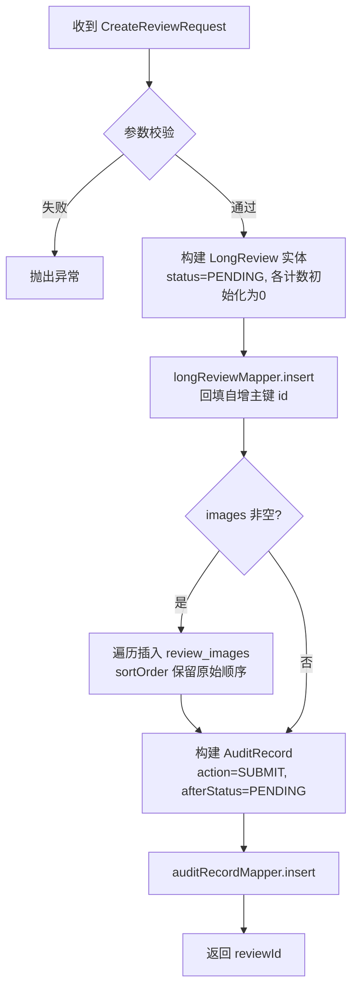
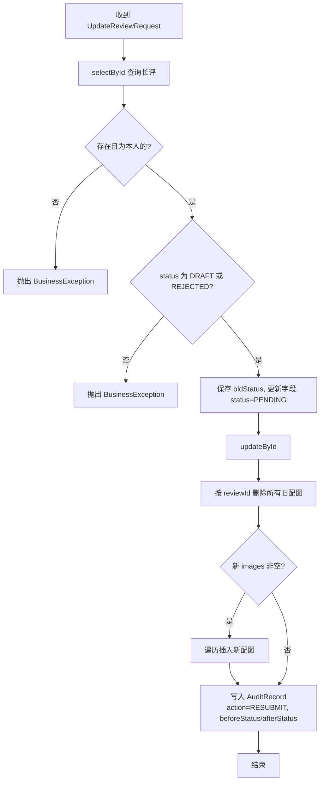
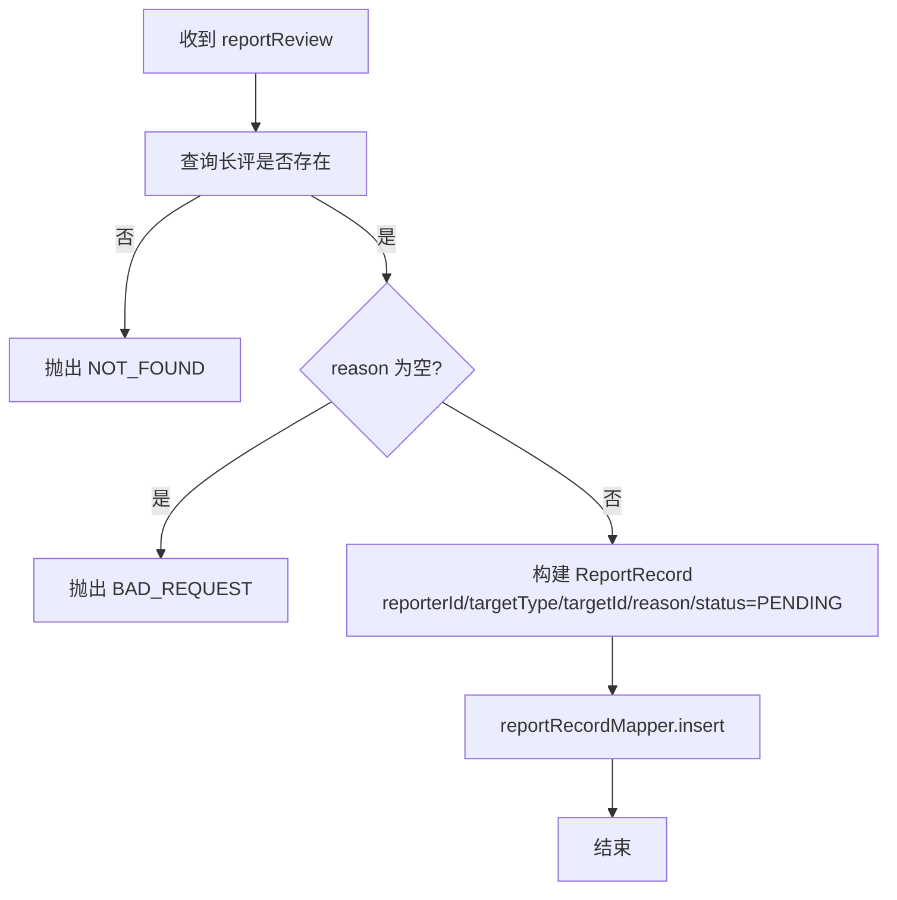
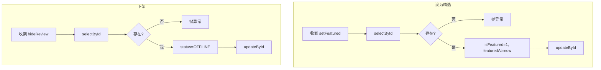
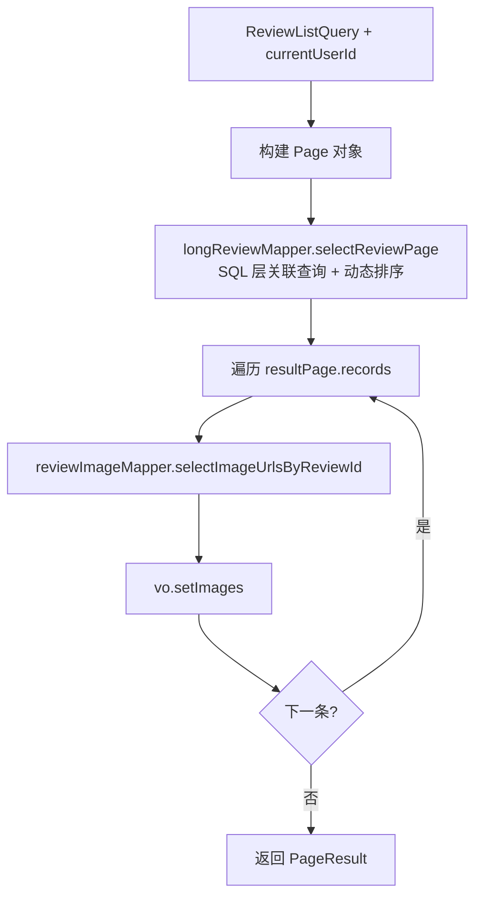
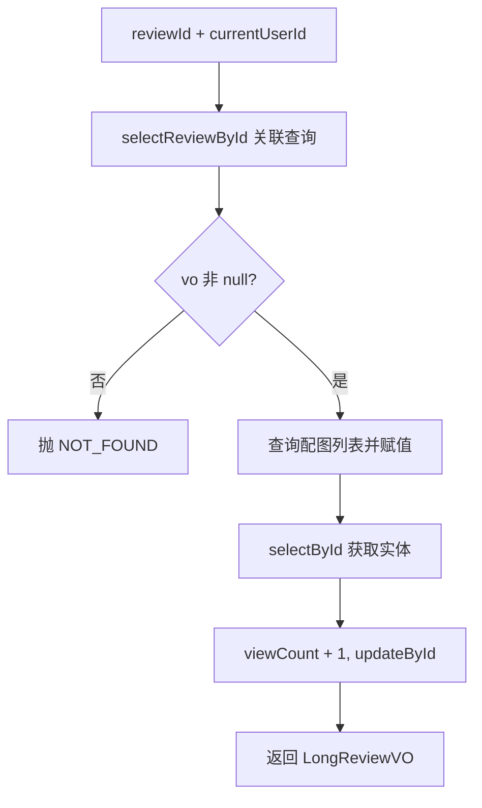

# 4.1 长评功能

长评功能基于 Spring Boot + MyBatis-Plus 实现，提供长评的发布、修改、列表查询、详情查看、点赞/取消点赞、收藏、举报、精选及管理员操作（上架/下架/删除）。服务层 `LongReviewServiceImpl` 通过 `@Transactional` 保证多表写入的原子性。

---

## 4.1.1 发布长评

用户对指定电影撰写长评并提交审核。涉及 `long_reviews`（主表）、`review_images`（配图）、`audit_records`（审核流水）三表联动写入。

**流程图：**



**设计要点：** `@Transactional` 保证三表写入原子性；新增长评统一初始化为 `PENDING` 状态，经审核后才能上线。

---

## 4.1.2 修改长评

仅允许修改处于"草稿（DRAFT）"或"已驳回（REJECTED）"状态的长评，修改后重新提交审核。配图采用"先删后插"策略全量替换。

**流程图：**



**设计要点：** 状态门控防止用户绕过审核修改已上线内容；配图全量替换避免逐张 diff 的复杂逻辑。

---

## 4.1.3 点赞/取消点赞（Toggle 模式）

同一接口同时承载点赞与取消：已点赞则删除记录并递减计数，未点赞则插入记录并递增计数。

**流程图：**

```mermaid
flowchart TD
    A[收到 likeReview] --> B[查询长评是否存在]
    B -->|否| C[抛出 NOT_FOUND]
    B -->|是| D[查询 likes 表<br>userId + targetType + targetId]
    D --> E{已有点赞记录?}
    E -->|是| F[deleteById 删除记录]
    F --> G[likeCount ← max(0, likeCount-1)]
    E -->|否| H[insert 新增点赞记录]
    H --> I[likeCount ← likeCount+1]
    G --> J[updateById 更新计数]
    I --> J
```

**设计要点：** Toggle 模式降低前后端耦合；`max(0, n-1)` 兜底防止并发场景下计数为负。

---

## 4.1.4 举报长评

用户填写举报原因后写入 `reports` 表，状态为 `PENDING`，由管理员后续人工处理。举报不自动触发下架。

**流程图：**



**设计要点：** 举报与长评状态解耦，下架由管理员手动执行；允许同一用户多次举报。

---

## 4.1.5 管理员操作

管理员可执行设为精选（`isFeatured=1, featuredAt=now`）、取消精选（`isFeatured=0, featuredAt=null`）、下架（`status=OFFLINE`）、上架（`status=ONLINE`）、软删除（`status=DELETED, deletedAt=now`）。所有操作流程一致：查询 → 校验存在性 → 更新对应字段。

**流程图（以设为精选和下架为例）：**



**设计要点：** 采用软删除策略保留数据用于审计；权限校验在 Controller 层通过拦截器完成，Service 层不感知角色。

---

## 4.1.6 列表查询与详情查看

**列表查询：** Mapper XML 层完成多表关联、动态排序（按 `sortBy` 参数映射 `ORDER BY`）及当前用户交互状态查询，Service 层负责分页封装和配图补充填充。



**详情查看：** 在列表查询基础上额外执行 `viewCount + 1`。浏览计数更新未纳入事务，轻微不精确可接受。



---

## 关键设计决策总结

| 设计点 | 决策 | 理由 |
|--------|------|------|
| 多表写入 | `@Transactional` 原子事务 | 防止主记录/配图/审核流水数据不一致 |
| 状态机 | DRAFT→PENDING→ONLINE/REJECTED→OFFLINE→DELETED | 所有内容经审核才能上线，生命周期可追溯 |
| 配图更新 | 先删后插全量替换 | 简化前后端交互，避免 diff 比对复杂度 |
| 点赞/收藏 | Toggle 单接口切换 | 降低前端耦合，减少接口数量 |
| 计数递减 | `max(0, n-1)` 兜底 | 防御并发场景下计数为负 |
| 删除策略 | 软删除（status=DELETED） | 保留数据用于审计和数据分析 |
| 举报与下架 | 解耦，不自动下架 | 人工审核原则，举报不直接影响内容展示 |